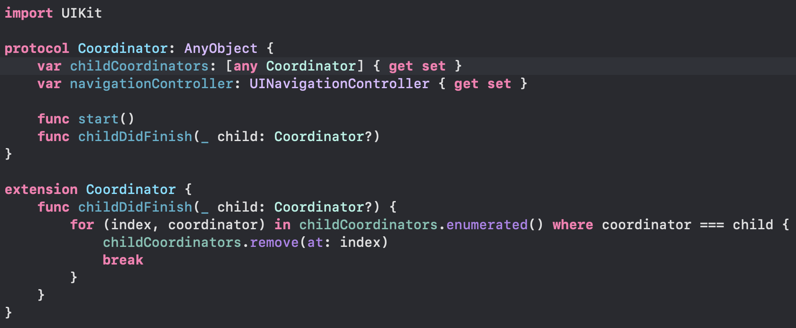
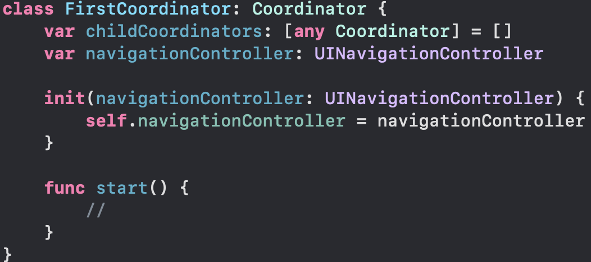
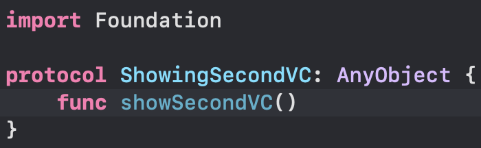
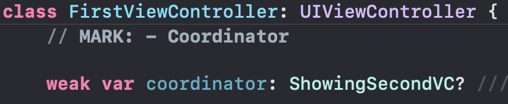
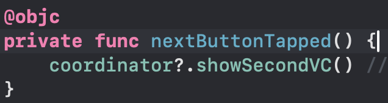
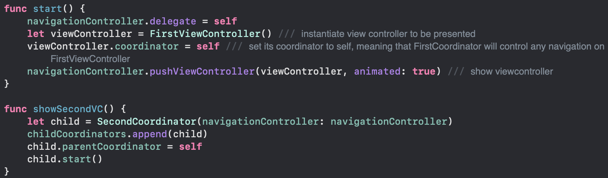
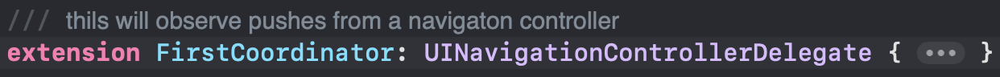
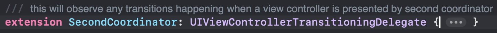

# Coordinator

### This repo exemplifies the use of the Coordinator design pattern on a UIKit project

---

#### Create Coordinator Protocol

#### Then you can create a class that conforms to this protocol to control navigation on a UIViewController

---

#### Create protocols that contains the methods you want to use to implement navigation

---

#### Create a reference to the coordinator inside your UIViewController

---

#### Use a method from coordinator inside your UIViewController

