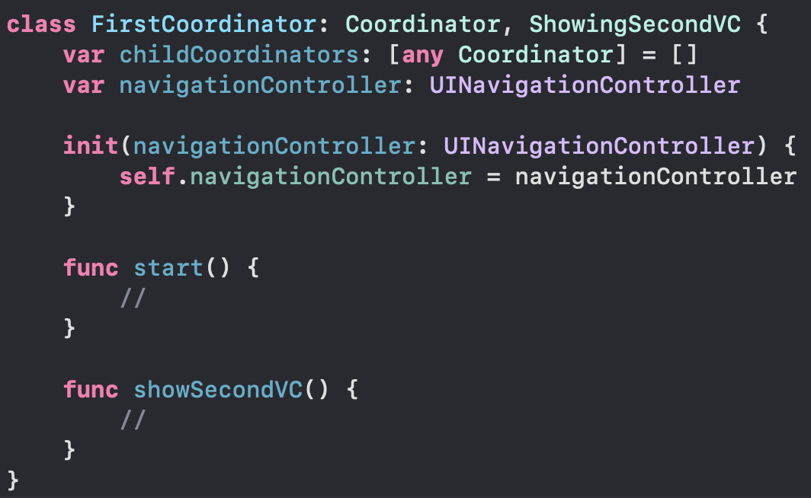

# Coordinator

### This repo exemplifies the use of the Coordinator design pattern on a UIKit project

---

#### Create Coordinator Protocol

---

#### Create protocols that contains the methods you want to use to implement navigation

---

#### Then you can create a class to control navigation on a UIViewController

---

#### Create a reference to the coordinator inside your UIViewController

---

#### Implement your coordinator's methods

---

#### Use a method from coordinator inside your UIViewController

---

#### Use UINavigationControllerDelegate or UIViewControllerTransitioningDelegate to observe changes on a navigation

#### * To use these delegates you must conform your Coordinator class with NSObject

#### * Remember to call 'childDidFinish' method when a UIViewController is dismissed to remove the current coordinator from its parent coordinator

